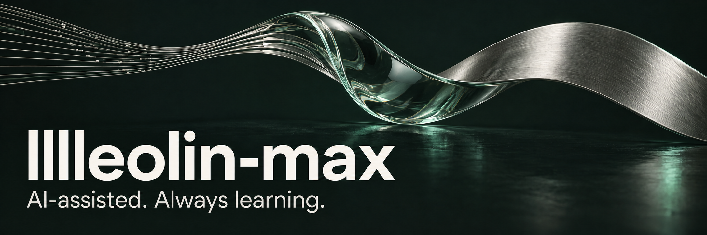
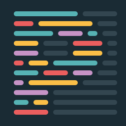
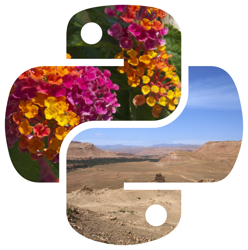

  
  

### AI-assisted contributions · AI 协作说明

I'm exploring AI-assisted code maintenance and pull requests as part of the real-world evaluation and data collection for **my own research project**. Code changes undergo **multiple rounds of AI auditing and cross-checking** using **GPT-6-Astra** with **Ultra** reasoning. I contribute ideas and take part in reviewing and revising the changes. My background is outside computer science, so mistakes and omissions may remain. **Corrections and guidance are always welcome.**

我正在尝试使用 AI 进行代码维护和提交 PR，为**自己的研究项目**开展实际检验和数据收集。使用模型为 **GPT-6-Astra**，思考深度为 **Ultra**。代码变更经过 **AI 的多轮审计与校对**，我本人参与审阅、修订和提出想法。由于我的背景并非计算机科学，仍难免有错误和疏漏，**欢迎大家不吝指教**。

> Need help? **[@mention me](https://github.com/lllleolin-max)** in the issue or PR. If a PR isn't useful, feedback is welcome, and you can simply close it. I'm very happy to learn and improve.
>
> 如需帮助，欢迎在 Issue 或 PR 中直接 **@ 我**。如果某个 PR 没能帮上忙，欢迎反馈，也可以直接关闭；我非常乐意学习和改进。

<!-- MERGED-CONTRIBUTIONS:START -->
## Open-source contributions · 开源贡献

  
  

**11 merged PRs across 4 upstream projects.** Only merged contributions are counted.

<table>
<tr>
<td width="50%" valign="top">
  
  <h3><a href="https://github.com/vuejs/vitepress">VitePress</a></h3>
  
<strong>8 merged PRs</strong> · Documentation tooling

  
Page layout, links, content loading and hot updates. 页面布局、链接处理、内容加载与热更新。

  <a href="https://github.com/vuejs/vitepress/pulls?q=is%3Apr+is%3Amerged+author%3Alllleolin-max">Explore contributions →</a>
</td>
<td width="50%" valign="top">
  
  <h3><a href="https://github.com/prettier/prettier">Prettier</a></h3>
  
<strong>1 merged PR</strong> · Code formatting

  
Preserve comment order in test calls. 修复测试调用中的注释顺序。

  <a href="https://github.com/prettier/prettier/pull/20043">Read the contribution →</a>
</td>
</tr>
<tr>
<td width="50%" valign="top">
  
  <h3><a href="https://github.com/python-pillow/Pillow">Pillow</a></h3>
  
<strong>1 merged PR</strong> · Python imaging

  
Correct <code>ImageOps.crop</code> type hints and docs. 修正边框类型注解与文档。

  <a href="https://github.com/python-pillow/Pillow/pull/9989">Read the contribution →</a>
</td>
<td width="50%" valign="top">
  
  <h3><a href="https://github.com/vllm-project/aibrix">AIBrix</a></h3>
  
<strong>1 merged PR</strong> · Inference infrastructure

  
Fix JSON message examples for the chat tokenizer. 修正聊天 tokenizer 的 JSON 示例。

  <a href="https://github.com/vllm-project/aibrix/pull/2713">Read the contribution →</a>
</td>
</tr>
</table>

<strong>Explore all 11 merged PRs · 展开完整贡献记录</strong>

### VitePress

- [#5430](https://github.com/vuejs/vitepress/pull/5430) — Fix page spacing when no sidebar is present · 修复无侧栏时的页面间距
- [#5434](https://github.com/vuejs/vitepress/pull/5434) — Use page locales in content loaders · 按页面语言加载内容
- [#5435](https://github.com/vuejs/vitepress/pull/5435) — Preserve string glob ignore patterns · 正确处理字符串排除规则
- [#5436](https://github.com/vuejs/vitepress/pull/5436) — Preserve queries and anchors on index-page links · 保留首页链接查询参数和锚点
- [#5440](https://github.com/vuejs/vitepress/pull/5440) — Preserve page data when injecting scripts · 保留页面数据并正确编译脚本
- [#5441](https://github.com/vuejs/vitepress/pull/5441) — Watch data files outside the site root · 让目录外数据变更触发热更新
- [#5442](https://github.com/vuejs/vitepress/pull/5442) — Resolve SVG links during prefetching · 修复 SVG 链接预取崩溃
- [#5443](https://github.com/vuejs/vitepress/pull/5443) — Infer image dimensions with URL suffixes · 正确推断带查询参数和锚点的图片尺寸

### Prettier · Pillow · AIBrix

- [Prettier #20043](https://github.com/prettier/prettier/pull/20043) — Preserve comment order in test calls · 修复测试调用中的注释顺序
- [Pillow #9989](https://github.com/python-pillow/Pillow/pull/9989) — Correct `ImageOps.crop` border type hints · 修正边框类型注解与文档
- [AIBrix #2713](https://github.com/vllm-project/aibrix/pull/2713) — Fix JSON message examples for the chat tokenizer · 修正聊天 tokenizer 示例

[All merged contributions →](https://github.com/search?q=is%3Apr+is%3Amerged+author%3Alllleolin-max+-user%3Alllleolin-max&type=pullrequests) · [Work in progress →](https://github.com/search?q=is%3Apr+is%3Aopen+author%3Alllleolin-max+-user%3Alllleolin-max&type=pullrequests)

Only merged upstream PRs are counted; my own repositories and unmerged PRs are excluded. Verified September 14, 2026. 仅统计已合并的对外贡献，不含个人仓库及未合并 PR。核验日期：2026 年 9 月 14 日。
<!-- MERGED-CONTRIBUTIONS:END -->
